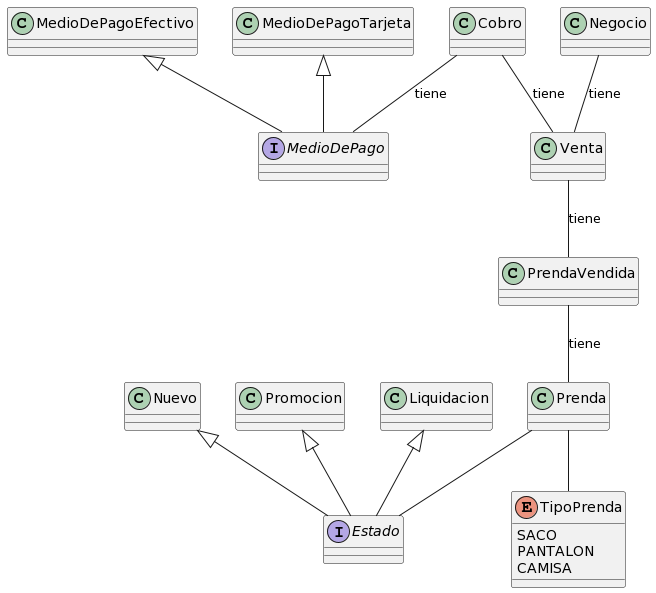

# DdS-Macowins



## Pseudocodigo
### Cobro
```
class Cobro
  Venta venta
	MedioDePago medioDePago
	
	Cobro(Venta venta, MedioDePago medioDePago)
		this.venta = venta
		this.medioDePago = medioDePago
	
	Float importe()
    return venta.importe() + medioDePago.recargo(venta)
```
### Medio de Pago
```
interface MedioDePago
	Float recargo(Venta venta)

class MedioDePagoEfectivo implements MedioDePago
	Float recargo(Venta venta)
		return 0

class MedioDePagoTarjeta  implements MedioDePago
	Integer cantidadDeCuotas
	Float coefPagoTarjeta

	MedioDePagoTarjeta(Float coefPagoTarjeta, Integer cantidadDeCuotas)
		this.coefPagoTarjeta = coefPagoTarjeta;
		this.cantidadDeCuotas = cantidadDeCuotas;

	Float recargo(Venta venta)
		Float recargo = cantidadDeCuotas * coefPagoTarjeta;
		for (PrendaVendida prendaVendida : venta.prendasVendidas())
			recargo += 0.01f * prendaVendida.getPrecioVenta()
		return recargo
```
### Estado
```
interface Estado
	Float precio(Prenda camisa)

class Liquidacion implements Estado
	Float precio(Prenda prenda)
		return prenda.precioBase() * 0.5f

class Nuevo implements Estado
	Float precio(Float precioPrenda)
		return precioPrenda

	Float precio(Prenda prenda)
		return prenda.precioBase()

class Promocion implements Estado
	Float descuento;

	Promocion(Float descuento)
		this.descuento = descuento

	Float precio(Prenda prenda)
		return prenda.precioBase() - descuento
```
### Prenda
```
class Prenda	
	private TipoPrenda tipoPrenda
	private Float precioBase
	private Estado estado
	
	Prenda(TipoPrenda tipoPrenda, Float precioBase, Estado estado)
		this.tipoPrenda = tipoPrenda
		this.precioBase = precioBase
		this.estado = estado
	
	TipoPrenda tipoPrenda()
		return tipoPrenda
	
	Float precioBase()
		return precioBase

	Float precio()
		return estado.precio(this)

enum TipoPrenda
	SACO, PANTALON, CAMISA
```
### Prenda Vendida
```
class PrendaVendida
	Prenda prenda
	Integer cantidadVendida
	
	PrendaVendida(Prenda prenda, Integer cantidadVendida)
		this.prenda = prenda
		this.cantidadVendida = cantidadVendida

	Float getPrecioVenta()
		return this.cantidadVendida * this.prenda.precio()
```
### Venta
```	
class Venta	
	Date fechaDeVenta
	Collection<PrendaVendida> prendasVendidas
	
	Venta(Date fechaDeVenta, Collection<PrendaVendida> prendasVendidas)
		this.fechaDeVenta = fechaDeVenta
		this.prendasVendidas = prendasVendidas
	
	Collection<PrendaVendida> prendasVendidas()
		return prendasVendidas
	
	Float importe()
		Float sumaTotlDePrendasVendidas = 0f
		for (PrendaVendida prendasVendida : prendasVendidas)
			sumaTotlDePrendasVendidas += prendasVendida.getPrecioVenta()
		return sumaTotlDePrendasVendidas
```
### Negocio
```
class Negocio	
	Float coeficientePagoTarjeta
	Float descuentoEstadoPromocion
	Collection<Venta> ventas
	
	Negocio(Float coeficientePagoTarjeta, Float descuentoEstadoPromocion)
		this.coeficientePagoTarjeta = coeficientePagoTarjeta
		this.descuentoEstadoPromocion = descuentoEstadoPromocion

	Float importeVentas(Date dia)
		Float ret = 0f
		for (Venta venta : ventas)
			ret += venta.importe()
		return ret
```
